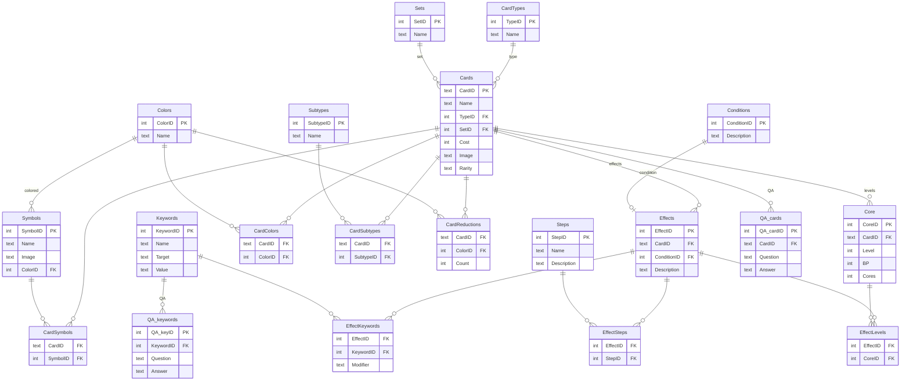

```mermaid
erDiagram
  CardTypes {
    int TypeID PK
    text Name
  }
  Sets {
    int SetID PK
    text Name
  }
  Colors {
    int ColorID PK
    text Name
  }
  Symbols {
    int SymbolID PK
    text Name
    text Image
    int ColorID FK
  }
  Subtypes {
    int SubtypeID PK
    text Name
  }
  Keywords {
    int KeywordID PK
    text Name
    text Target
    text Value
  }
  Steps {
    int StepID PK
    text Name
    text Description
  }
  Conditions {
    int ConditionID PK
    text Description
  }
  Cards {
    text CardID PK
    text Name
    int TypeID FK
    int SetID FK
    int Cost
    text Image
    text Rarity
  }
  CardColors {
    text CardID FK
    int ColorID FK
  }
  CardSymbols {
    text CardID FK
    int SymbolID FK
  }
  CardSubtypes {
    text CardID FK
    int SubtypeID FK
  }
  CardReductions {
    text CardID FK
    int ColorID FK
    int Count
  }
  Core {
    int CoreID PK
    text CardID FK
    int Level
    int BP
    int Cores
  }
  Effects {
    int EffectID PK
    text CardID FK
    int ConditionID FK
    text Description
  }
  EffectLevels {
    int EffectID FK
    int CoreID FK
  }
  EffectKeywords {
    int EffectID FK
    int KeywordID FK
    text Modifier
  }
  EffectSteps {
    int EffectID FK
    int StepID FK
  }
  QA_cards {
    int QA_cardID PK
    text CardID FK
    text Question
    text Answer
  }
  QA_keywords {
    int QA_keyID PK
    int KeywordID FK
    text Question
    text Answer
  }

  CardTypes      ||--o{ Cards         : "type"
  Sets           ||--o{ Cards         : "set"
  Colors         ||--o{ Symbols       : "colored"
  Cards          ||--o{ CardColors    : ""
  Colors         ||--o{ CardColors    : ""
  Cards          ||--o{ CardSymbols   : ""
  Symbols        ||--o{ CardSymbols   : ""
  Cards          ||--o{ CardSubtypes  : ""
  Subtypes       ||--o{ CardSubtypes  : ""
  Cards          ||--o{ CardReductions: ""
  Colors         ||--o{ CardReductions: ""
  Cards          ||--o{ Core          : "levels"
  Cards          ||--o{ Effects       : "effects"
  Conditions     ||--o| Effects       : "condition"
  Effects        ||--o{ EffectLevels  : ""
  Core           ||--o{ EffectLevels  : ""
  Effects        ||--o{ EffectKeywords: ""
  Keywords       ||--o{ EffectKeywords: ""
  Effects        ||--o{ EffectSteps   : ""
  Steps          ||--o{ EffectSteps   : ""
  Cards          ||--o{ QA_cards      : "QA"
  Keywords       ||--o{ QA_keywords   : "QA"
```
